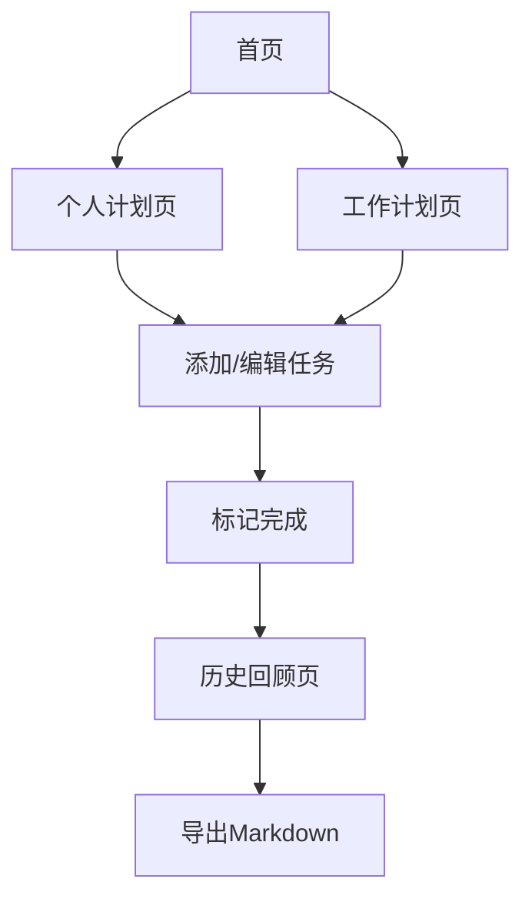

## 1. 产品概述
每日计划清单是一个帮助用户管理个人和工作计划的Web应用，支持分类管理不同类型的任务，提供直观的TodoList界面和Markdown导出功能。

目标用户：需要高效管理日常任务的职场人士、学生和自我管理爱好者。通过分类管理和历史回顾功能，帮助用户建立良好的计划习惯。

## 2. 核心功能

### 2.1 用户角色
本应用为单用户应用，无需注册登录，数据本地存储。

### 2.2 功能模块
应用包含以下主要页面：
1. **首页**：显示今日计划概览，包含个人计划和工作计划的快速入口
2. **个人计划页**：管理个人精进、杂事、复盘三个分类的任务
3. **工作计划页**：管理日常工作、杂事、工作提升、碎片化学习、向优秀的人学习五个分类的任务
4. **历史回顾页**：查看历史完成的任务和数据统计
5. **导出页面**：支持将计划以Markdown格式导出

### 2.3 页面详情

| 页面名称 | 模块名称 | 功能描述 |
|----------|----------|----------|
| 首页 | 今日概览 | 显示今日未完成任务数量和分类统计 |
| 首页 | 快速入口 | 提供个人计划和工作计划的快速跳转按钮 |
| 首页 | 最近完成 | 显示最近完成的5个任务 |
| 个人计划页 | 个人精进 | 添加、编辑、删除、标记完成个人成长相关任务 |
| 个人计划页 | 杂事 | 管理个人生活中的琐碎事务 |
| 个人计划页 | 复盘 | 记录每日反思和总结 |
| 工作计划页 | 日常工作 | 管理日常工作任务 |
| 工作计划页 | 工作杂事 | 处理工作中的临时事务 |
| 工作计划页 | 工作提升 | 记录技能提升和学习计划 |
| 工作计划页 | 碎片化学习 | 管理零散时间的学习内容 |
| 工作计划页 | 向优秀的人学习 | 记录观察和学习他人的要点 |
| 历史回顾页 | 日历视图 | 按日期查看历史完成任务 |
| 历史回顾页 | 统计图表 | 显示任务完成趋势和分类统计 |
| 导出页面 | Markdown导出 | 将选定日期范围的任务导出为Markdown格式 |

## 3. 核心流程

### 主要用户流程：
1. **日常任务管理流程**：
   - 用户打开应用 → 查看今日概览 → 进入个人/工作计划页 → 添加新任务 → 完成任务后标记 → 查看完成状态

2. **历史回顾流程**：
   - 用户进入历史回顾页 → 选择日期范围 → 查看完成的任务 → 导出Markdown报告

## 4. 用户界面设计

### 4.1 设计风格
- **主色调**：蓝色系（#3B82F6）为主，绿色（#10B981）表示完成状态
- **按钮样式**：圆角矩形，hover效果，主要操作为实心按钮
- **字体**：系统默认字体，标题16-18px，正文14px，小字12px
- **布局风格**：卡片式布局，清晰的分类分区
- **图标风格**：使用简洁的线性图标

### 4.2 页面设计概述

| 页面名称 | 模块名称 | UI元素 |
|----------|----------|----------|
| 首页 | 今日概览 | 顶部显示日期，卡片展示各分类任务数量和完成率，使用进度条可视化 |
| 首页 | 快速入口 | 大按钮卡片，图标+文字，点击跳转对应页面 |
| 个人计划页 | 任务列表 | 每个分类独立卡片，任务项左侧复选框，右侧编辑删除按钮，支持拖拽排序 |
| 工作计划页 | 任务列表 | 五列网格布局，每列一个分类，任务项同个人计划页设计 |
| 历史回顾页 | 日历视图 | 月历网格，每天显示完成数量，点击可查看详情 |
| 导出页面 | 导出控制 | 日期选择器，分类选择，预览区域，导出按钮 |

### 4.3 响应式设计
- **移动端优先**：基础设计以移动端为主，单列布局
- **平板适配**：768px以上显示双列布局
- **桌面端**：1024px以上显示完整多列布局
- **触摸优化**：按钮和交互元素适合触摸操作，最小点击区域44px