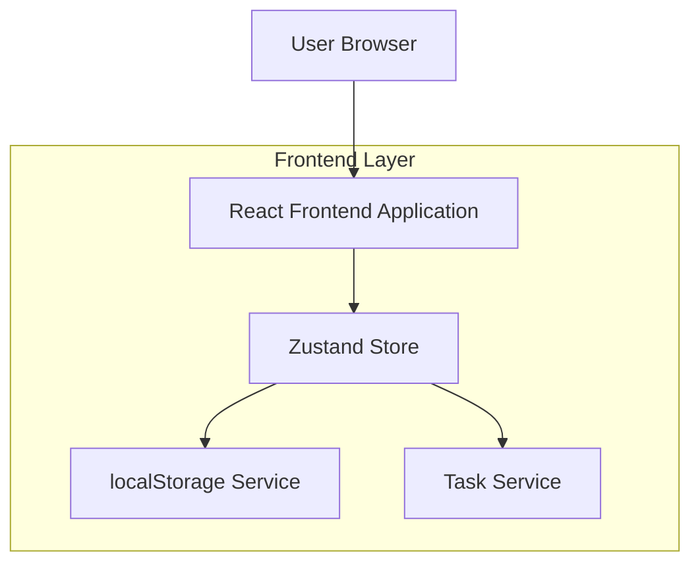
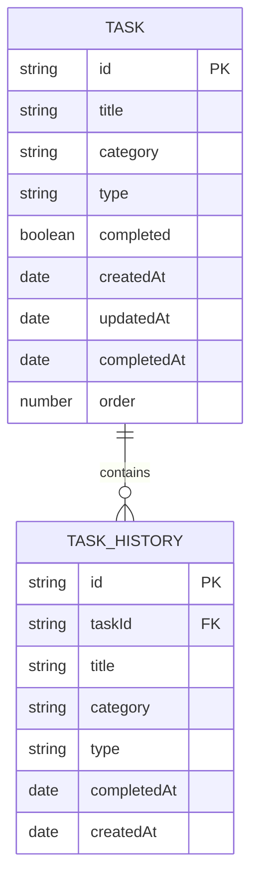

## 1. 架构设计



## 2. 技术栈描述

- **前端**: React@18 + TypeScript@5 + Tailwind CSS@3 + Vite@5
- **状态管理**: Zustand@4
- **数据存储**: localStorage（客户端本地存储）
- **构建工具**: Vite
- **路由**: React Router@6
- **UI组件**: 自定义组件 + Tailwind CSS

## 3. 路由定义

| 路由 | 用途 |
|------|------|
| / | 首页，显示今日概览和快速入口 |
| /personal | 个人计划页，管理个人精进、杂事、复盘任务 |
| /work | 工作计划页，管理日常工作、杂事、工作提升等任务 |
| /history | 历史回顾页，查看历史完成任务和统计 |
| /export | 导出页面，支持Markdown格式导出 |

## 4. 数据模型

### 4.1 数据模型定义



### 4.2 数据定义

任务表（tasks）
```typescript
interface Task {
  id: string;
  title: string;
  category: 'personal-improvement' | 'personal-misc' | 'personal-review' | 
           'work-daily' | 'work-misc' | 'work-improvement' | 'work-learning' | 'work-observation';
  type: 'personal' | 'work';
  completed: boolean;
  createdAt: Date;
  updatedAt: Date;
  completedAt?: Date;
  order: number;
}
```

任务历史表（taskHistory）
```typescript
interface TaskHistory {
  id: string;
  taskId: string;
  title: string;
  category: Task['category'];
  type: Task['type'];
  completedAt: Date;
  createdAt: Date;
}
```

### 4.3 本地存储结构

```typescript
interface LocalStorageData {
  tasks: Task[];
  taskHistory: TaskHistory[];
  settings: {
    theme: 'light' | 'dark';
    exportTemplate: string;
  };
}
```

## 5. 核心服务设计

### 5.1 任务服务（TaskService）
```typescript
class TaskService {
  // 创建任务
  createTask(task: Omit<Task, 'id' | 'createdAt' | 'updatedAt'>): Task;
  
  // 更新任务
  updateTask(id: string, updates: Partial<Task>): Task;
  
  // 删除任务
  deleteTask(id: string): void;
  
  // 标记完成状态
  toggleTaskComplete(id: string): Task;
  
  // 获取分类任务
  getTasksByCategory(category: Task['category']): Task[];
  
  // 获取今日任务
  getTodayTasks(): Task[];
  
  // 导出Markdown
  exportToMarkdown(tasks: Task[], dateRange: DateRange): string;
}
```

### 5.2 存储服务（StorageService）
```typescript
class StorageService {
  // 保存数据
  saveData(key: string, data: any): void;
  
  // 读取数据
  loadData(key: string): any;
  
  // 清除数据
  clearData(key: string): void;
  
  // 导出所有数据
  exportAllData(): LocalStorageData;
  
  // 导入数据
  importData(data: LocalStorageData): void;
}
```

## 6. 状态管理设计

### 6.1 Zustand Store结构
```typescript
interface AppStore {
  // 任务状态
  tasks: Task[];
  taskHistory: TaskHistory[];
  
  // UI状态
  currentView: 'home' | 'personal' | 'work' | 'history' | 'export';
  loading: boolean;
  
  // 方法
  addTask: (task: Omit<Task, 'id' | 'createdAt' | 'updatedAt'>) => void;
  updateTask: (id: string, updates: Partial<Task>) => void;
  deleteTask: (id: string) => void;
  toggleTask: (id: string) => void;
  
  // 筛选和获取
  getTasksByCategory: (category: Task['category']) => Task[];
  getTodayStats: () => { total: number; completed: number; byCategory: Record<string, number> };
  
  // 导出
  exportToMarkdown: (dateRange: DateRange) => string;
}
```

## 7. 组件架构

### 7.1 页面组件
- `HomePage`: 首页组件
- `PersonalPlanPage`: 个人计划页面
- `WorkPlanPage`: 工作计划页面
- `HistoryPage`: 历史回顾页面
- `ExportPage`: 导出页面

### 7.2 通用组件
- `TaskList`: 任务列表组件
- `TaskItem`: 任务项组件
- `CategoryCard`: 分类卡片组件
- `DatePicker`: 日期选择器
- `MarkdownPreview`: Markdown预览组件

### 7.3 布局组件
- `AppLayout`: 应用主布局
- `Navigation`: 导航组件
- `Header`: 头部组件